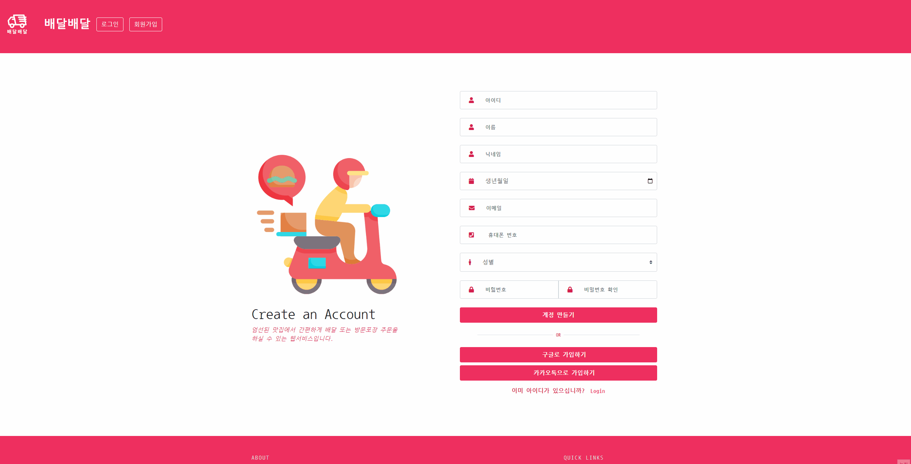
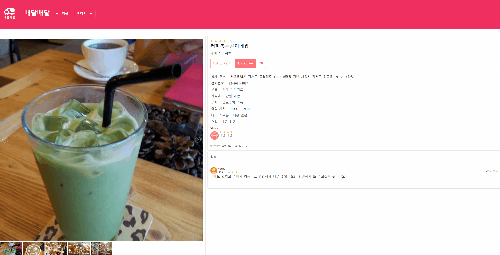

# 🔔 토이프로젝트( 내주변 맛집 찾기- 배달배달 ) 

## **📄 개요**

   
  
   

> **프로젝트:** 맛집서치 - 배달배달
>
> **기획 및 제작:** 김동현
>
> **분류:** 개인 프로젝트
>
> **제작 기간:** 2023.07.07 ~ 07.28
>
> **배포일:** x
>
> **사용 기술:** SPRING BOOT
>
> **문의:** dhk9309@gmail.com
> 
> 

## **🔨 기술 및 도구**
|Category|                  Detail                   |
|:--:|:-----------------------------------------:|
|FrontEnd|          HTML5, JS, CSS3, JQuery          |
|BackEnd|  Java(JDK 1.8), Servlet, Spring, Mybatis  |
|OS|                Windows 10                 |
|Libray&API|Spring Security, Validation,Lombok,Kakaomap
|IDE|      IntelliJ, VisualStudio, DBeaver      |
|Server|               Tomcat(v8.5)                |
|Document|          Google Drive, ERDCloud           |
|CI|                  Github                   |
|DateBase|                  MariaDB                  |

## **💻 기능구현**

### 1. 메인 페이지 & 프로젝트 목표

> 
> **프로젝트 목표**
> 
> **1.** 동적(Selenium), 정적(jsoup) 크롤링 사용
>
> **2.** 전국 음식점 데이터 사용
>
> **3.** 카카오맵 API 사용
> 

 

#### 1-1. 내 주변 맛집 검색

  - 내 주변의 식당을 카테고리 & 검색으로 검색 가능
  - 카카오맵 API 를 이용해 식당 위치를 시각화
  - 내 위치를 자동으로 설정하기 위해 Geolocation API 사용
    
   

#### 1-2. 음식종류 선택 -> 내 주변 음식점 리스트 출력

  - 메인 메뉴에서 음식종류 선택으로 주변 음식점 리스트 출력 
  - DB에 저장된 데이터가 아닌 크롤링된 데이터 사용
  - jsoup을 사용하여 페이지 로딩속도 개선

 

#### 1-2. 음식점 디테일 페이지 

  
  - 정적 크롤링 & 동적 크롤링 혼합 사용으로 페이지 로딩속도 개선 
  - 크롤링 된 데이터로 음식점 이미지, 별점 등 출력
  - 동적 크롤링(Selenium)을 사용하여 리뷰정보 크롤링
  - 자바스크립트를 사용해 댓글 리스트 차례로 출력 

 

#### 2-1. 회원가입 & 로그인 

  
  -  스프링 시큐리티를 사용하여 로그인 & 회원가입 구현 
  -  자바스크립트 & Spring Validation 을 사용하여 유효성검사 실시

 

#### 2-2. 회원페이지 & 찜기능 

  
  -  마이페이지 에서 내 정보 확인가능  
  -  음식점 상세 페이지에서 찜기능으로 즐겨찾기 추가 가능 
  -  즐겨찾기 목록 클릭시 음식점 상세 페이지로 이동 가능 

 